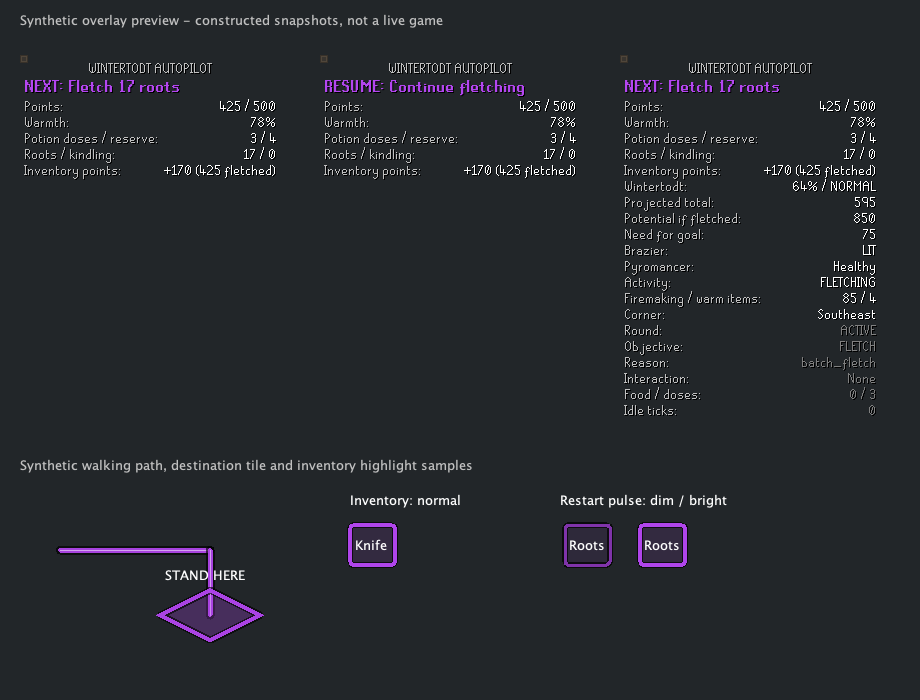

# Wintertodt Autopilot

A RuneLite helper that chooses one useful next action and highlights its object, NPC or inventory items. You perform every click, movement and interaction.

This is a first mass-world implementation, ready for live testing. It has not been submitted to the Plugin Hub, and live Wintertodt acceptance remains unverified.

## What it does

- Builds an immutable snapshot every game tick, using current RuneLite gameval constants.
- Tracks round countdown, energy, Warmth, points, inventory, activity and the local brazier/pyromancer.
- Keeps an automatic working corner stable, with an option to select any corner manually.
- Prioritizes Warmth recovery, repairs and healing/lighting before the normal resource loop.
- Offers Balanced, Firemaking XP, Points / Rewards and Low Attention strategies.
- Plans chopping and fletching batches from inventory capacity and projected points.
- Resumes unfinished batches after low Warmth and action interruptions. Active chopping stays ahead of brazier maintenance until the resource batch is ready.
- Feeds existing fuel near round end, using conservative energy/drain-rate categories.
- Prepares tools and 1–3 rejuvenation potions before chopping, guiding crate → bruma herb → mixing (or Brew'ma without Druidic Ritual). Restocks between rounds, rather than after every consumed dose.
- Estimates potion reserves from Firemaking, equipped warm items, current Warmth, remaining round energy and carried food.
- Routes a thick, outlined walking line through loaded walkable tiles, respecting walls and target footprints.
- Marks the walkable interaction tile with an action label, plus floor breadcrumbs along the route. Inventory actions mark your current tile.
- Shows RESUME and gently pulses relevant inventory, object and tile highlights after interruptions; normal activity clears the cue.
- Displays a movable Minimal, Normal or Detailed panel, objective-only outlines, inventory highlights and an optional hint arrow.
- Sends optional attention notifications after inactivity, with episode gating and a 30-second cooldown. Emergency Warmth notifications are enabled by default.
- Shows observed state and decision reasons in debug mode.

Reward goals determine useful batches. Once a fixed goal is earned, normal play continues toward the next 500-point threshold. Inventory points are projections conditional on feeding before the round ends; they are not rewards already secured. Extra points between thresholds can still improve rewards.

Synthetic rendering of the normal panel, a restart instruction, debug mode, and highlight styles (constructed snapshots, not a live game):



## Build and run

Use Java 17. Sources target Java 11, and the project pins RuneLite **1.13.1** and Gradle **8.10** for reproducible builds.

```sh
./gradlew build
./gradlew run
```

`run` opens RuneLite in developer mode with the plugin loaded. Search for **Wintertodt Autopilot** in the plugin settings. Hold Alt to move the panel. Enable **Debug overlay and logs** for live observation.

The regular plugin jar is produced at `build/libs/wintertodt-autopilot-0.1.0.jar`. Plugin Hub distribution requires a reviewed source submission; the jar alone is not a Hub installation.

## Scope and limitations

- Mass strategies are implemented. Solo strategy is deliberately deferred until the mass engine has been validated in-game; there is no misleading Solo preset.
- Walking paths use the current loaded scene and cardinal steps. If no route is found, no line is drawn. Paths end beside objects/NPCs and do not operate doors or plan routes across unloaded regions.
- Potion quantities are a bounded mass-round estimate, not a guarantee against random attacks. Warm item detection uses a bundled name registry and may omit new cosmetic variants. Hitpoints does not affect current Warmth damage.
- Energy and current-round points come from the current game HUD, because no confirmed dedicated public varbits for those values were found. Missing widget values remain unknown.
- Pyromancer detection uses transformed NPC compositions. Missing local NPC state remains unknown rather than being treated as healthy.
- Food detection combines an Eat action with RuneLite's theoretical healing of at least 4 HP, and excludes known non-warming foods. This conservative detection can omit restorative drinks or foods absent from RuneLite's item-stat registry; rejuvenation potions are explicitly supported.
- Ending categories are heuristics. They cannot guarantee time to earn 500 points.
- If Warmth is low and no usable restorative is held, guidance directs you to the safe lobby. Full inventories blocking tools or potion ingredients require you to make space.
- Live corner/object mapping, interruption timing and strategy pacing need validation before release. The test suite and startup smoke check do not replace that validation.

See [research and API mapping](docs/RESEARCH.md) and the [live validation checklist](docs/LIVE_VALIDATION.md).
